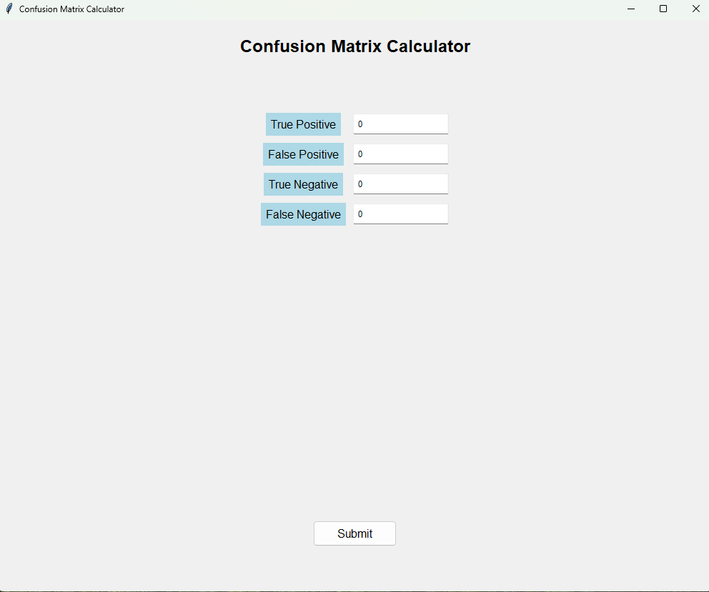

## Confusion Matrix Calculator

### Background
A lightweight application written in Python to compute precision, recall, accuracy, and F1 score from a confusion matrix. The Python script is converted to an executable (.exe) file for ease of use, so other users do not need to have Python installed. 

### How to use?
Simply navigate to the 'dist' folder, download the 'app.exe', and run it locally. The confusion matrix calculator is ready to use.

